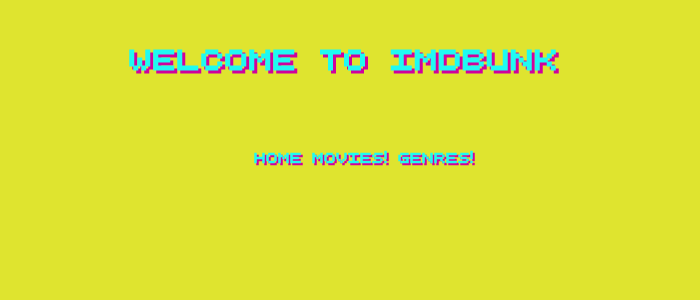
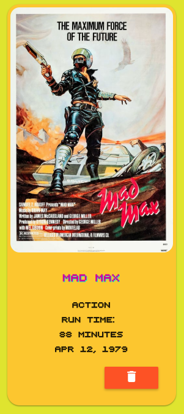
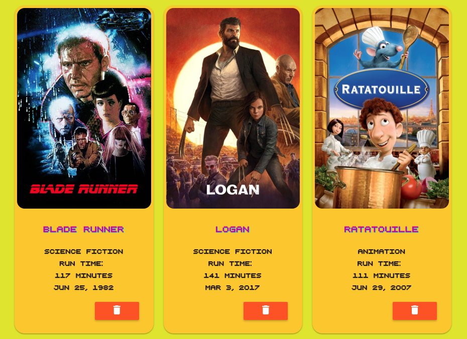

# Movie Collection Manager

a simple movie collection app build using SEAN stack.
> 4 day weekend project

 ## Screenshots

 \

 \

 ## Technologies used:
 
• SQL(Postgres) \
• Express \
• AngularJS \
• Node \
• Angular Material \
• HTML/CSS \
\
• Shoutout: TMDb API

